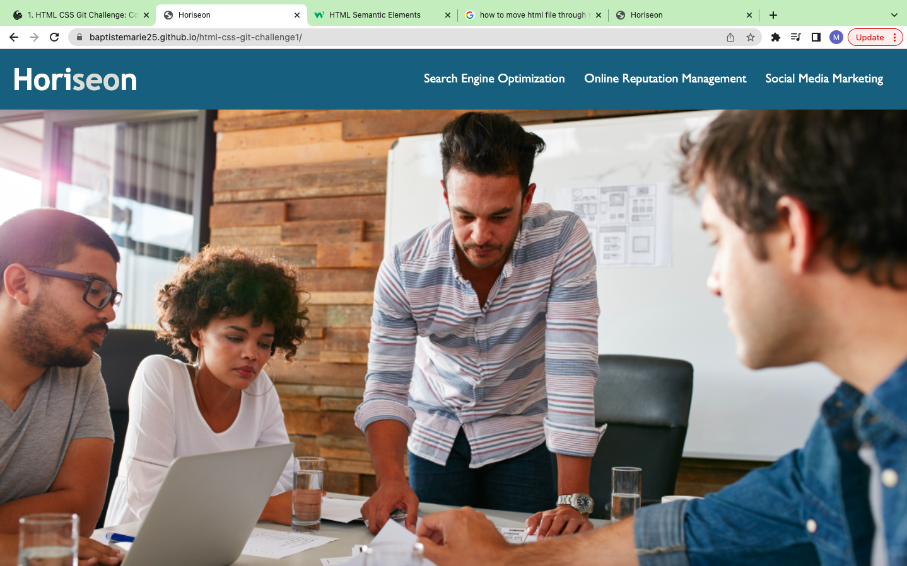

# HTML CSS Git Challenge: Code Refactor

## Description 

Horiseon is a marketing agency offering services to businesses for social media marketing, lead generation and brand awareness. The original site did not follow accessibility standards thus was not optimized for search engines. 

I have restructured the html in order to meet the accessibility standards by adding semantic elements. I also restructured the CSS styling to flow better with the html. I have added alt text to the images and missing id to header elements. The heading of the html are also in sequential order and I have added a descriptive title for the page.

## Screenshot 

## Link To Application
[Horiseon](https://baptistemarie25.github.io/html-css-git-challenge1/)

